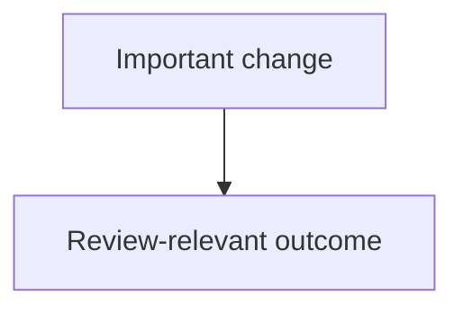

# Iago

Generate a concise Mermaid diagram that explains the important logic in a PR diff, then either print an idempotent `iago` block locally or update the PR comment/body when the user explicitly wants it published.

Iago is for review communication, not for finding new review issues. Run a normal review first when the code has not been inspected.

## Inputs

- Optional diagram type: `flow`, `sequence`, `class`, or `entity-relation`.
- Optional PR number or URL. If absent, resolve the current branch PR with `gh pr view --json number,url,headRefName,baseRefName`.
- Optional publish mode. If the user did not explicitly ask to post/update GitHub, output the block locally only.

## Workflow

1. Resolve PR context.
   - Prefer `gh pr diff <pr>` for the reviewed diff.
   - Also read relevant changed files when the diff alone is not enough.
2. Pick the diagram type.
   - `flowchart TD` for branching logic, save guards, validation paths, and state transitions.
   - `sequenceDiagram` for BE to FE contracts, request lifecycles, async calls, and event chains.
   - `classDiagram` for object/model relationships.
   - `erDiagram` for database entities.
   - Honor an explicit type from `/iago <type>` or `/squawk <type>`.
3. Generate one small diagram.
   - Show only review-relevant logic.
   - Use stable node names and short labels.
   - Avoid dumping every changed file into the diagram.
4. Wrap the result in the idempotent block:

````markdown
<!-- iago:begin -->

<!-- iago:end -->
````

5. Validate the Mermaid syntax by inspection. Prefer simpler syntax over clever formatting.
6. Publish only when requested.

## Publishing

Use `gh` CLI, not GitHub MCP, for GitHub writes.

When publishing:

1. Read existing PR body and issue comments.
2. If an `<!-- iago:begin -->` / `<!-- iago:end -->` block already exists, replace only that block.
3. If no block exists, create a new top-level PR comment with the block.
4. Do not create duplicate iago comments.

Suggested commands:

```bash
gh pr view <pr> --json number,url,body,comments
gh pr comment <pr> --body-file <file>
gh api repos/:owner/:repo/issues/comments/<comment_id> --method PATCH --field body=@<file>
```

## Safety

- Do not post automatically to a team PR unless the user asked to publish.
- Do not use GitHub MCP comment tools for this skill.
- If repo instructions ban automated GitHub comments broadly, print the block locally and ask before publishing.
- Keep the diagram explanatory, not decorative.
